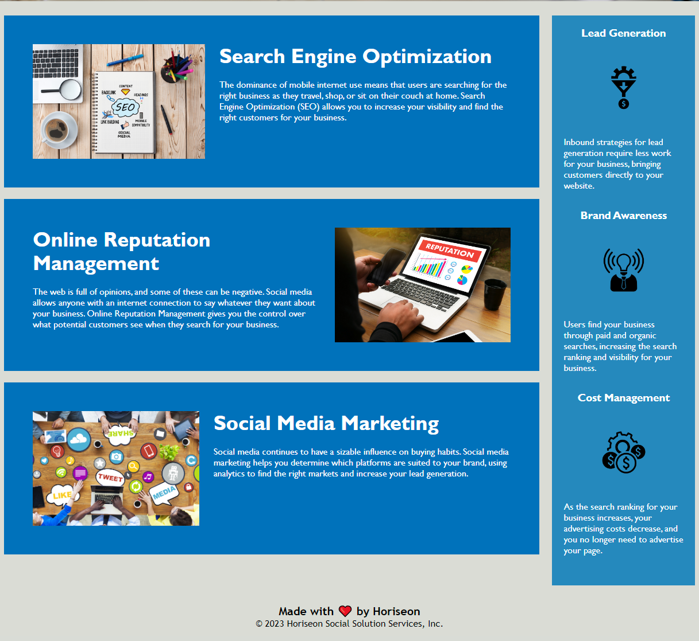

# SEO-Marketing-Site

## Description

This application is a marketing landing page demonstration SEO and accesibility standards. It will help employers market there services to consumers. 

Code Highlights:

* Semanitc tags
* Alt tags 
* Consolidated CSS
* Commenting on changes made

Demo App [https://sam-cowman.github.io/SEO-Marketing-Site/](https://sam-cowman.github.io/SEO-Marketing-Site/)

## Usage
The customer who wants to use this product will utilize it on getting information to market there product to consumers. 

## License
No License 

